# 从“复制一份数据”到“发一份补丁”：MatrixOne Data Branch 把数据变更变成可回放的工作流（Diff/Merge/Restore + 跨集群同步）

> 我们想解决的不是“怎么再备份一份”，而是这三件事：**随时落一个可靠锚点、开出互不打扰的试验台、把变更做成可审阅/可回放的补丁。**

---

## 序幕：双线并行的一张表，怎么不互相踩？

“今晚必须把风控规则修掉。”  
“同时运营要做活动，数据得按新口径重算。”  
“你们都别动 `orders` 表，我先拷一份出来吧……”

这句“我先拷一份”，在很多团队里几乎是条件反射：复制库、复制表、复制到新集群、再把一堆脚本跑一遍。  
问题也跟着来：

- 拷贝很慢（数据越大越慢），而且越急越容易拷错、漏拷
- 成本很高（存储、带宽、算力、时间都在烧）
- 最麻烦的是：**你很难说清楚“到底改了哪些数据”**，更难把它“有选择地带回去”

MatrixOne Data Branch 想做的，是把这件事改造成一种“像工程一样可重复”的流程：不靠一堆临时副本，也不靠口头约定。

---

## 1. 先把目标说清楚：我们需要的是 5 个动作

如果把“数据变更”当成主角，那工作流里最常用的动作其实就五个：

1) **Snapshot**：在你动手之前，先留一个“可回到的点”  
2) **Clone/Branch**：从这个点开出一张“试验台”（隔离修改）  
3) **Diff**：把试验台上的改动“讲清楚”（可审阅、可追溯）  
4) **Merge**：把“确认正确的改动”带回主表（并处理冲突）  
5) **Restore**：如果后悔了，回到那个点（止血优先）

在 MatrixOne 里，这些动作都能用 SQL 串起来：`CREATE SNAPSHOT`、`DATA BRANCH DIFF`、`DATA BRANCH MERGE`、`RESTORE ... FROM SNAPSHOT`，再配合 `CLONE`（或新版本中的专用创建语义）把“分支表”拉出来。

---

## 2. 一段可复现的“剧情脚本”：两条线并行修改，同步回主表

下面这套 SQL 你可以按顺序跑一遍，感受它和“复制数据库做实验”的区别。

### 2.1 第一幕：主表就绪，先把“锚点”打上

```sql
drop database if exists demo_branch;
create database demo_branch;
use demo_branch;

create table orders_base (
  order_id     bigint primary key,
  user_id      bigint,
  amount       decimal(12,2),
  risk_flag    tinyint,           -- 0=normal, 1=high risk
  promo_tag    varchar(20),
  updated_at   timestamp
);

insert into orders_base values
(10001, 501,  99.90, 0, null, '2025-12-01 10:00:00'),
(10002, 502, 199.00, 0, null, '2025-12-01 10:00:00'),
(10003, 503,  10.00, 0, null, '2025-12-01 10:00:00');

create snapshot sp_orders_v1 for table demo_branch orders_base;
```

你可以把 `sp_orders_v1` 理解成“所有人都认可的起跑线”。后面无论怎么折腾，都能回得来。

### 2.2 第二幕：开两张试验台（风控线 / 活动线）

如果你的版本支持专用“创建分支表”语义，可以直接用它；如果没有，也可以用 `CLONE` 方式（两者的使用体验是一样的：从快照视图拉出一张新表用于独立改动）。

```sql
-- Option A: CLONE (works as a branch table in current versions)
create table orders_riskfix clone orders_base {snapshot='sp_orders_v1'};
create table orders_promo  clone orders_base {snapshot='sp_orders_v1'};

-- Option B: if your version supports it
-- data branch create table orders_riskfix from orders_base{snapshot='sp_orders_v1'};
-- data branch create table orders_promo  from orders_base{snapshot='sp_orders_v1'};
```

### 2.3 第三幕：两条线各自修改，互不干扰

```sql
-- Risk-fix line
update orders_riskfix
   set risk_flag = 1,
       updated_at = '2025-12-01 10:05:00'
 where order_id = 10002;

delete from orders_riskfix where order_id = 10003;
insert into orders_riskfix values
(10003, 503, 10.00, 0, 'repaired', '2025-12-01 10:06:00');

-- Promo line
update orders_promo
   set promo_tag = 'double11',
       amount = amount * 0.9,
       updated_at = '2025-12-01 10:07:00'
 where order_id in (10001, 10002);

insert into orders_promo values
(10004, 504, 39.90, 0, 'double11', '2025-12-01 10:07:30');
```

这一步最关键的感受是：你不用先复制一份 TB 级数据，也不用担心“我改表会不会把别人搞崩”。两条线天然隔离，谁也不需要“先等等我”。

### 2.4 第四幕：把“改了什么”说清楚（Diff）

为了让 diff 可重复、可定位，一般会给分支表再打一次快照：

```sql
create snapshot sp_riskfix for table demo_branch orders_riskfix;
create snapshot sp_promo   for table demo_branch orders_promo;

data branch diff orders_riskfix{snapshot='sp_riskfix'}
  against orders_promo{snapshot='sp_promo'};
```

`DATA BRANCH DIFF` 会把两边的行级差异列出来（插入/删除/更新），让“数据变更”从口头描述变成可以审阅的结果。

### 2.5 第五幕：把确认的改动带回主表（Merge + 冲突策略）

```sql
-- Merge risk fix first
data branch merge orders_riskfix into orders_base;

-- Then try promo (choose a conflict strategy if needed)
data branch merge orders_promo into orders_base when conflict skip;
-- data branch merge orders_promo into orders_base when conflict accept;
```

这里的“冲突”你可以把它理解成：两条线都动到了同一行、同一主键，目标表应该听谁的。  
`FAIL/SKIP/ACCEPT` 三种策略，让你把“合并规则”写进 SQL，而不是写进微信群里。

### 2.6 第六幕：不满意就回到起跑线（Restore）

如果合并后发现方向不对，先止血：

```sql
restore database demo_branch table orders_base from snapshot sp_orders_v1;
```

这句 SQL 的意义不是“把你当成不会操作的人”，而是把“回退”从高风险操作变成常规动作：敢试验，才跑得快。

---

## 3. 一张图把流程连起来（主表 / 分支表 / diff / merge / restore）


---

## 4. 进阶：把 diff 做成“补丁文件”，跨集群/跨环境重放

很多团队真正头疼的不是“我能不能 diff/merge”，而是这些工程问题：

- 预发需要每天刷新，但不想整库搬运
- 灾备演练想验证“能不能把关键变更快速补齐”
- 多集群部署时，希望把变更从 A 端“带到” B 端，而不是重新跑一遍脚本

Data Branch 提供了一个很实用的落点：**把 diff 输出成文件**。文件就是补丁：能带走、能存档、能在别处回放。

### 4.1 把 diff 输出到本地目录

```sql
data branch diff branch_tbl against base_tbl output file '/tmp/diffs/';
```

输出结果会告诉你文件保存位置，同时给出导入/执行提示。常见形态是两类：

- **CSV**：更适合“目标为空/初始化”的全量导入
- **.sql**：更适合“目标非空/增量同步”的补丁回放（通常由 `DELETE FROM ...` + `REPLACE INTO ...` 组成）

### 4.2 把 diff 直接写到 stage（例如 S3）

```sql
create stage stage01 url =
  's3://bucket/prefix?region=cn-north-1&access_key_id=xxx&secret_access_key=yyy';

data branch diff t1 against t2 output file 'stage://stage01/';
```

这让“把补丁发给另一个集群”变得很直白：源端写到对象存储，目标端拿到文件即可。

### 4.3 回放补丁：执行 SQL 或导入 CSV

- **回放 SQL（增量）**：在目标集群执行生成的 `.sql` 文件即可（MatrixOne 兼容 MySQL 协议）  
- **导入 CSV（初始化）**：用 `LOAD DATA` 把 CSV 导入目标表即可

示意（SQL 文件回放）：

```bash
mysql -h <mo_host> -P <mo_port> -u <user> -p <db_name> < diff_xxx.sql
```

示意（CSV 导入）：

```sql
load data local infile '/tmp/diffs/diff_xxx.csv'
into table demo_branch.orders_base
fields enclosed by '"' escaped by '\\' terminated by ','
lines terminated by '\n';
```

---

## 5. 落地小抄：把它变成团队习惯，而不是一次“炫技”

如果你准备把 Data Branch 用进真实项目，下面这几条比“会不会写 SQL”更重要：

- **先定命名规则**：快照名、分支表名要能一眼看懂用途（例如 `sp_orders_yyyymmdd_hhmm`）  
- **关键表要有主键/唯一键**：diff/merge 的可控性依赖于“怎么定位一行数据”  
- **把 diff 当成评审材料**：让数据变更也能做 review（尤其是高风险口径调整）  
- **先小表试流程**：把“创建 → 修改 → diff → merge → restore” 跑顺，再扩到核心链路  

---

## 延伸阅读
* [MatrixOrigin, “AI 时代的数据管理新范式：Git for Data 让数据工程化”, InfoQ 写作社区](https://xie.infoq.cn/article/50d702e4a50b8168ea0a71fb5#:~:text=1)
* [“Git for Data: 像 Git 一样管理你的数据”, InfoQ 中国](https://www.infoq.cn/article/8qjz1tqen5qngx3g8ofu#:~:text=MatrixOne%20%E5%B7%B2%E5%85%B7%E5%A4%87%20Git%20for%20Data,%E7%9A%84%E6%A0%B8%E5%BF%83%E8%83%BD%E5%8A%9B%EF%BC%8C%E5%8C%85%E6%8B%AC%EF%BC%9A)
* [MatrixOne CREATE SNAPSHOT](https://docs.matrixorigin.cn/v25.3.0.0/MatrixOne/Reference/SQL-Reference/Data-Definition-Language/create-snapshot/)
* [MatrixOne RESTORE SNAPSHOT](https://docs.matrixorigin.cn/v25.3.0.0/MatrixOne/Reference/SQL-Reference/Data-Definition-Language/restore-snapshot/)
* [MatrixOne LOAD DATA](https://docs.matrixorigin.cn/en/dev/MatrixOne/Reference/SQL-Reference/Data-Manipulation-Language/load-data-infile/)
* [PlanetScale Docs: Data Branching®](https://planetscale.com/docs/vitess/schema-changes/data-branching)
* [lakeFS: Data Collaboration & Branching](https://lakefs.io/)
